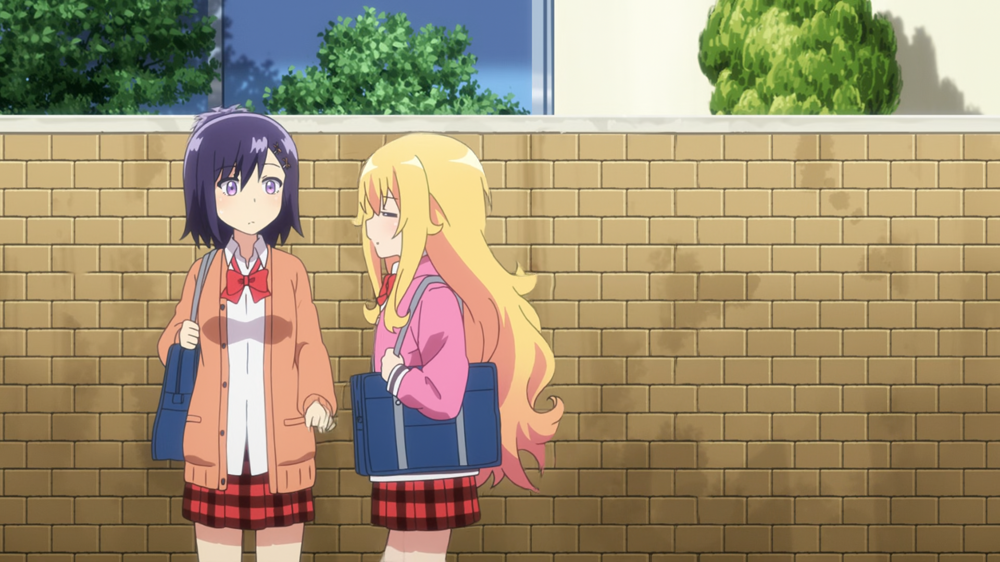
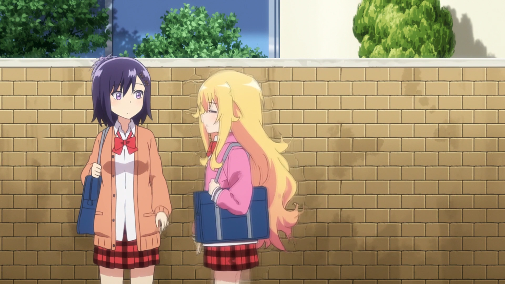

[中文说明](https://github.com/Mr-Z-2697/ddfi/blob/main/README.chi.md)☚
# ddfi
#### dedup frame interpolate
A clumsy video auto duplication remove and frame interpolate script (mainly for 24fps cfr animation with dup-frames (by dup-frames I mean the shot on twos, threes and etc. things)

## The basic idea:
1. Remove duplicated frames (resulting a vfr video that technically has minimal fps 8)
2. Interpolate 8x (to ensure minimal fps parts will be above 60fps after interpolation)
3. Extract timestamps from de-dupped video, then calculate the timestamps of interpolated frames
4. "Correct" the interpolated video with caculated timestamps
5. Convert to 60fps cfr video

*(yeah, its basically just simply excuting commands automatically except new-timestamps calculating part)*  
*(this is old concept and is not how the script now operates, but the general idea is the same)*

## Usage:
run `ddfi2.py -h` or `python ddfi2.py -h` for detail

## Example:
left: this script(rife ver.) | right: use rife directly (2-pass, with mvtools to make 24->96->60)

https://user-images.githubusercontent.com/74594146/142829178-ff08b96f-9ca7-45ab-82f0-4e95be045f2d.mp4

## Downsides:
more visible artifacts because you are actually interpolating frames instead of f***ing with same frames over and over

rife ver.:

svp ver.:

